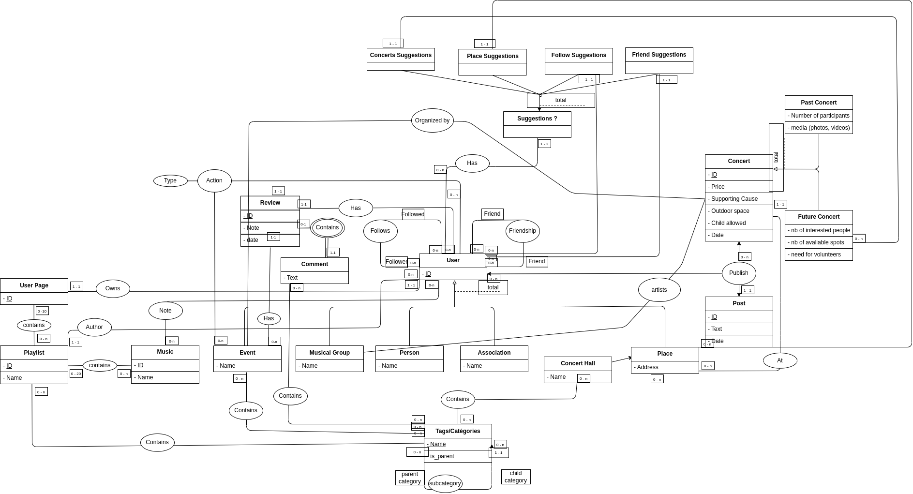

# Rapport de projet
- [Rapport de projet](#rapport-de-projet)
  - [Schéma entités-associations](#schéma-entités-associations)
  - [Modélisation de la base de données](#modélisation-de-la-base-de-données)
  - [Realisation du projet](#realisation-du-projet)

## Schéma entités-associations

## Modélisation de la base de données

1. `user`
    - `id`: clé primaire, auto-incrémentée.
    - `name`: non null.
    
2. `follow`
    - `follower_id`: clé étrangère référençant `user.id`.
    - `followed_id`: clé étrangère référençant `user.id`.
    
3. `friendship`
    - `friend1_id`: clé étrangère référençant `user.id`.
    - `friend2_id`: clé étrangère référençant `user.id`.
    
4. `event`
    - `user_id`: clé primaire, clé étrangère référençant `user.id`.
    
5. `group`
    - `user_id`: clé primaire, clé étrangère référençant `user.id`.
    
6. `person`
    - `user_id`: clé primaire, clé étrangère référençant `user.id`.
    
7. `place`
    - `user_id`: clé primaire, clé étrangère référençant `user.id`.
    - `address`: non null, unique.
    
8. `concertHall`
    - `place_id`: clé primaire, clé étrangère référençant `place.user_id`.
    - `name`: non null.
    
9. `associations`
    - `user_id`: clé primaire, clé étrangère référençant `user.id`.
    
10. `user_page`
    - `id`: clé primaire, auto-incrémentée.
    - `user_id`: non null, clé étrangère référençant `user.id`.
    
11. `music`
    - `id`: clé primaire, auto-incrémentée.
    - `author_id`: non null, clé étrangère référençant `user.id`.
    - `name`: non null.
    
12. `music_notes`
    - `music_id`: non null, clé étrangère référençant `music.id`.
    - `user_id`: non null, clé étrangère référençant `user.id`.
    - `note`: non null, entre 0 et 5.

13. `playlist`
    - `id`: clé primaire, auto-incrémentée.
    - `author_id`: non null, clé étrangère référençant `user.id`.
    - `name`: non null.
    - `user_page`: clé étrangère référençant `user_page.id`.

14. `page_playlist`
    - `user_page_id`: clé primaire, clé étrangère référençant `user_page.id`.
    - `playlist_id`: clé primaire, clé étrangère référençant `playlist.id`.

15. `playlist_music`
    - `playlist_id`: clé primaire, clé étrangère référençant `playlist.id`.
    - `music_id`: clé primaire, clé étrangère référençant `music.id`.

16. `concert`
    - `id`: clé primaire, auto-incrémentée.
    - `organizer_event_id`: non null, clé étrangère référençant `event.user_id`.
    - `artists_group_id`: non null, clé étrangère référençant `group.user_id`.
    - `place_id`: non null, clé étrangère référençant `place.user_id`.
    - `price`: non null.
    - `supporting_cause`: non null.
    - `outdoor_space`: non null.
    - `child_allowed`: non null.
    - `concert_date`: non null, par défaut la date courante.

17. `pastConcert`
    - `concert_id`: clé primaire, clé étrangère référençant `concert.id`.
    - `nb_participants`: non null.

18. `pastConcertMedia`
    - `pastconcert_id`: non null, clé étrangère référençant `pastConcert.concert_id`.
    - `photo`: non null.

19. `futureConcert`
    - `concert_id`: clé primaire, clé étrangère référençant `concert.id`.
    - `need_volunteers`: non null.
    - `nb_interested_people`: non null.
    - `nb_available_spots`: non null.

20. `post`
    - `id`: clé primaire, auto-incrémentée.
    - `text`: non null.
    - `user_id`: non null, clé étrangère référençant `user.id`.
    - `concert_id`: non null, clé étrangère référençant `concert.id`.
    - `post_date`: non null, par défaut la date courante.

21. `tags`
    - `name`: clé primaire.
    - `is_parent`: non null, par défaut false.

22. `parent_child_tags`
    - `parent`: non null, clé étrangère référençant `tags.name`.
    - `child`: non null, clé étrangère référençant `tags.name`.

23. `concert_hall_tags`
    - `place_id`: clé primaire, clé étrangère référençant `concertHall.place_id`.
    - `tag_name`: clé primaire, clé étrangère référençant `tags.name`.

24. `event_tags`
    - `event_id`: clé primaire, clé étrangère référençant `event.user_id`.
    - `tag_name`: clé primaire, clé étrangère référençant `tags.name`.

## Realisation du projet

Notre modèle de base de données a été conçu pour gérer un réseau social centré sur la musique. Nous avons axé notre approche sur l'aspect relationnel de la base de données, garantissant que chaque table soit interconnectée de manière appropriée pour permettre des requêtes efficaces.

La table "user" représente le cœur de notre base de données. C'est la base sur laquelle toutes les autres entités dépendent. Le choix de cette modélisation provient de la centralité de l'utilisateur dans le fonctionnement du système : que ce soit en tant qu'artiste, organisateur d'événements, membre d'un groupe, ou tout simplement utilisateur ordinaire.

Nous avons également accordé une importance particulière à la flexibilité et à la robustesse de notre modèle. Par exemple, nous avons mis en place des contraintes sur certaines tables comme `playlist_music` et `page_playlist` pour garantir l'intégrité des données. Nous avons également prévu des tables pour stocker des informations sur les événements passés et futurs, et des tags pour les playlists ou les commentaires.

Cependant, notre modèle a certaines limitations. Par exemple, il peut être un peu compliqué à gérer en raison du grand nombre de tables et des relations entre elles. De plus, certaines des contraintes que nous avons mises en place peuvent limiter la flexibilité du système. Par exemple, la limite du nombre de morceaux dans une playlist, bien qu'elle contribue à maintenir l'ordre et à éviter les abus, peut être un inconvénient pour certains utilisateurs qui souhaitent créer des playlists plus grandes.

Nous avons choisi d'implémenter les 20 requêtes qui répondent le plus aux besoins de notre réseau social. Par exemple, des requêtes pour récupérer des informations sur un utilisateur, pour rechercher de la musique par auteur ou par tag, pour afficher les détails d'un événement, ou pour trouver des amis ou des followers. Nous avons également mis en place des requêtes pour gérer les actions de l'utilisateur, comme participer à un événement ou montrer de l'intérêt pour un événement. Pour finir, nous avons créer des requêtes pour gérer les playlists et pour ajouter ou retirer de la musique de celles-ci.