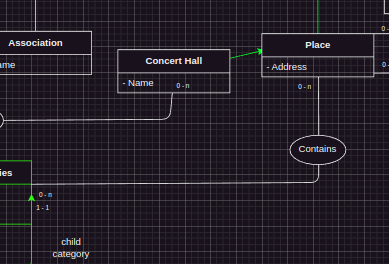

# Backlog

## Todo


## Done
- [x] Schéma entités-associations
  - [x] multiplicités
  - [x] User suggestions
  - [x] Contraintes, par example revoir relation publish entre concert, user e post.
  - [x] problème avec avis (event, user, concert passé)
  - [x] chanson peut etre associé à 0 playlist?
  - [x] plusieurs flèches relation entre concernt, avis et user.
  - [x] demander si totale (pour user, concert...)
  - [x] Lieux (user)
  - [x] attributs de chaque entité
  - [x] relations et connection
  - [x] User historique
  - [x] Contrainte playlist_music
- [x] Table Tags
- [x] Constraint tags
- [x] Relation Tags (some)

## Notes/Questions/Suggestions
1. Ajouter id pour chaque type de user? e.g.
```sql
CREATE TABLE places (
  -- place_id ?
  user_id INT PRIMARY KEY,
  address VARCHAR(255) UNIQUE NOT NULL,
  FOREIGN KEY (user_id) REFERENCES users(id) ON DELETE CASCADE
);
```
2. This relationship between place and tags is weird...I get that there is a relation between concert hall and tags but not place.



3. Do we need to add a primary key for the relation/junction tables (e.g. Friends table with (user_id, user_id))?